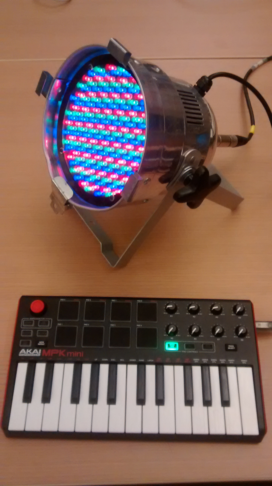

# ofxMIDI2DMX
A openframeworks program that converts midi to dmx

This was created by Akiva Krauthamer as part of IACD.

This program combines the ofxDMX addon and the ofxMidi addon.

To use:
-Plug a midi device in to you're computer.
-Plug a Enttec DMXUSB Pro in to your computer.
-Plug one or more DMX device in to the DMXUSB Pro.
-Run the program and turn the control knobs. Control channels and DMX adresses are mapped one to one.
-Enjoy

